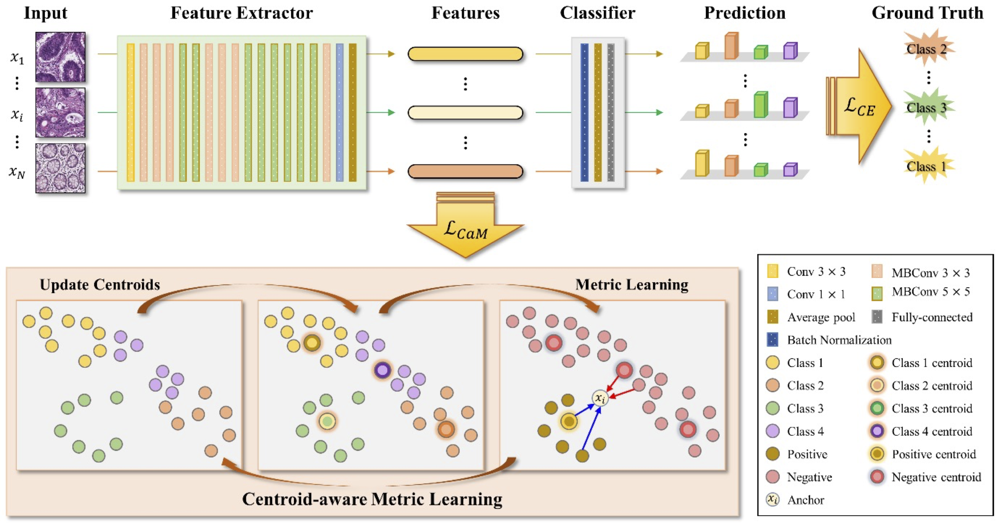

# CaMeL-Net : Centroid-aware Metric Learning for Efficient Multi-class Cancer Classification in Pathology Images
by Jaeung Lee, Chiwon Han, Kyungeun Kim, Gi-Ho Park, and Jin Tae Kwak.

## Introduction
This repository is for our CMPB 2023 paper [Centroid-aware Metric Learning for Efficient Multi-class Cancer Classification in Pathology Images]
(-).



CaMeL-Net is a network designed to predict cancer grades in pathological images. 
The network leverages centroids of different classes to compute relative distances between input images and utilizes 
metric learning for optimization. The centeroid-aware margin loss is employed not only for positive and negative samples 
but also for efficient and effective metric learning utilizing centroids from distinct classes. The proposed network 
predicts input pathological images with relevant class labels, i.e., cancer grades.

## Datasets
All the models in this project were evaluated on the following datasets:

- [Colon_KBSMC](https://github.com/QuIIL/KBSMC_colon_cancer_grading_dataset) (Colon TMA from Kangbuk Samsung Hospital)
- [Colon_KBSMC](https://github.com/QuIIL/KBSMC_colon_cancer_grading_dataset) (Colon WSI from Kangbuk Samsung Hospital)
- [Gastric_KBSMC](-) (Gastric from Kangbuk Samsung Hospital)

## Set Up Environment

```
conda env create -file environment.yml
conda activate CameLNet
```

## Repository Structure
Below are the main directories in the repository:
- `data/`: datasets and figures used in the repo
- `utils/`: utils that are
- `lossfunction/`: CaM loss definition
- `model_lib/`: model definition
- `pretrained/`: pretrained weights that are

Below are the main executable scripts in the repository:
- `config.py`: configuration file
- `dataprepare.py`: data loader file
- `tester_CaMeLNet.py`: evalution-only script
- `trainer_CaMeLNet.py`: main training script


Details of data folder
1. Clone the dataset and set up the folders in the following structure:
```
 └─ data 
    └─ colon
    |  ├─ KBSMC_colon_tma_cancer_grading_1024
    |  |  ├─ 1010711
    |  |  ├─ ...
    |  |  └─ wsi_00018
    |  └─ KBSMC_colon_45wsis_cancer_grading_512 (Test 2)
    |     ├─ wsi_001
    |     ├─ ...
    |     └─ wsi_100
    └─ gastric
       ├─ gastric_wsi
       |  ├─ gastric_wsi_PS1024_80_her01_step05_bright230_resize05
       |  |  ├─ gastric_0
       |  |  ├─ ...
       |  |  └─ gastric_95
       |  ├─ gastric_wsi_PS1024_80_her01_step10_bright230_resize05
       |  |  ├─ gastric_0
       |  |  ├─ ...
       |  |  └─ gastric_95
       |  └─ gastric_wsi_PS1024_80_her01_split.csv
       └─ gastric_wsi_addition
          ├─ gastric_wsi_addition_PS1024_ano08_step05_bright230
          |  |  ├─ gastric_0
          |  |  ├─ ...
          |  |  └─ gastric_61
          ├─ gastric_wsi_addition_PS1024_ano08_step05_bright230_resize05
          |  |  ├─ gastric_0
          |  |  ├─ ...
          |  |  └─ gastric_61
          ├─ gastric_wsi_addition_PS1024_ano08_step10_bright230
          |  |  ├─ gastric_0
          |  |  ├─ ...
          |  |  └─ gastric_61
          ├─ gastric_wsi_addition_PS1024_ano08_step10_bright230_resize05
          |  |  ├─ gastric_0
          |  |  ├─ ...
          |  |  └─ gastric_61
          └─ gastric_wsi_addition_PS1024_ano08_split.csv
```

# Running the Code

## Training and Options
 
```
  python trainer_CaMeLNet.py [--gpu=<id>] [--data_name=<colon/gastric>] [--wandb_id=<your wandb id>] [--wandb_key=<your wandb key>]
```
## Inference

```
  python tester_CaMeLNet.py [--gpu=<id>] [--data_name=<colon/gastric>] [--wandb_id=<your wandb id>] [--wandb_key=<your wandb key> [--pretrained_weight=<True>]]
```

### Model Weights

Model weights obtained from training CaMeL-Net here:
- [Colon checkpoint](https://github.com/colin19950703/CaMeLNet/tree/main/pretrained)
- [Gastric checkpoint](https://github.com/colin19950703/CaMeLNet/tree/main/pretrained)

If any of the above checkpoints are used, please ensure to cite the corresponding paper.

## Citation
If CaMeL-Net is useful for your research, please consider citing the following paper:
```angular2html
```
